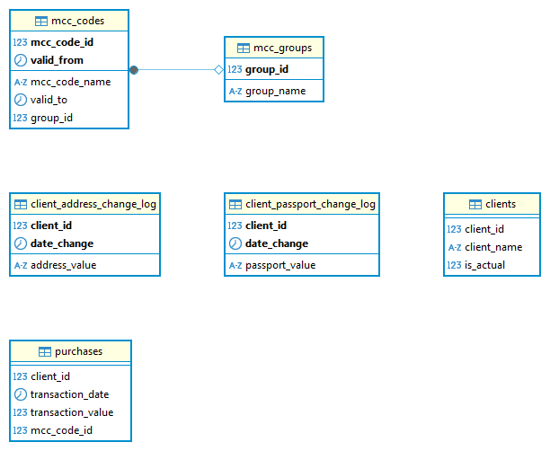

#  Merchant Database

This document describes the structure of the **Merchant** database. It includes information on purchases, MCC codes (merchant category codes), clients, and the history of changes in clients’ personal information.

---

##  Entity Relationship Diagram

---

##  MCC Groups

### `mcc_groups`

| Column      | Description                     |
|-------------|---------------------------------|
| `group_id`  | MCC group identifier            |
| `group_name`| Name of the MCC group           |

---

##  MCC Codes

### `mcc_codes`

Tracks which group a given MCC code belonged to in different time periods.

| Column         | Description                                                             |
|----------------|-------------------------------------------------------------------------|
| `mcc_code_id`  | MCC code identifier                                                     |
| `mcc_code_name`| Name of the MCC code                                                    |
| `valid_from`   | Start date for when this code belonged to a specific MCC group          |
| `valid_to`     | End date for this MCC-group relationship                                |
| `group_id`     | Linked group ID (FK - `mcc_groups`)                                     |

>  **Note**: MCC group assignments **can change over time**. When joining with purchases, use a date-based filter: 
> **Purchase date must fall within `valid_from` and `valid_to`** for a given `mcc_code_id`.  
> The date ranges do not overlap.

---

##  Purchases

### `purchases`

Records of all purchases made by clients.

| Column            | Description                                  |
|-------------------|----------------------------------------------|
| `client_id`       | Client identifier (FK - `clients`)           |
| `transaction_date`| Date of transaction                          |
| `transaction_value`| Amount of the transaction                   |
| `mcc_code_id`     | MCC code identifier (FK - `mcc_codes`)       |

---

##  Clients

### `clients`

List of clients and their status.

| Column       | Description                          |
|--------------|--------------------------------------|
| `client_id`  | Client identifier                    |
| `client_name`| Name of the client                   |
| `is_actual`  | 1 = active, 0 = inactive             |

---

##  Passport Changes

### `client_passport_change_log`

Tracks changes to client passport data.

| Column           | Description                                  |
|------------------|----------------------------------------------|
| `client_id`      | Client identifier (FK - `clients`)           |
| `date_change`    | Date of passport change                      |
| `passport_value` | New passport value                           |

---

##  Address Changes

### `client_address_change_log`

Tracks changes to client residence registration address.

| Column           | Description                                  |
|------------------|----------------------------------------------|
| `client_id`      | Client identifier (FK - `clients`)           |
| `date_change`    | Date of address change                       |
| `address_value`  | New address value                            |

---

>>  Return to [DATABASES_OVERVIEW.md](../DATABASES_OVERVIEW.md)

>  ER Diagram should be saved as: `img/merchant_schema.png`
