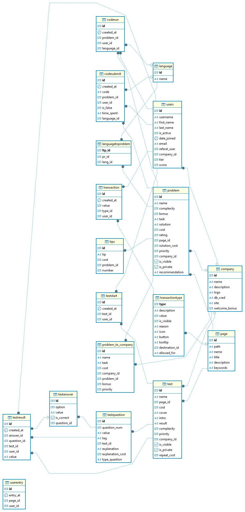

#  Simulative Database

This document describes the full structure of the **Simulative** platform database, including users, tasks, companies, language support, tests, transactions, and more.

---

##  Entity Relationship Diagram

---

##  Users Tables

### `Users`

Contains information about all platform users.

| Column         | Description                                   |
|----------------|-----------------------------------------------|
| `id`           | Unique user ID                                |
| `username`     | Platform login                                |
| `first_name`   | First name                                    |
| `last_name`    | Last name                                     |
| `is_active`    | Whether the account is activated              |
| `date_joined`  | Registration datetime                         |
| `email`        | Email address                                 |
| `referal_user` | Referring user                                |
| `company_id`   | Linked company ID (FK - Company)              |
| `tier`         | Platform rank                                 |
| `score`        | Experience points                             |

### `UserEntry`

Tracks the **first user entry per day**.

| Column     | Description                            |
|------------|----------------------------------------|
| `id`       | Entry ID                               |
| `entry_at` | Date and time of platform access       |
| `page_id`  | Page visited (FK - Page)               |
| `user_id`  | User ID (FK - Users)                   |

---

##  General Tables

### `Page`

Stores information about platform pages.

| Column        | Description                    |
|---------------|--------------------------------|
| `id`          | Page ID                        |
| `path`        | Relative URL                   |
| `name`        | Page name                      |
| `title`       | SEO title                      |
| `description` | SEO description                |
| `keywords`    | Comma-separated keywords       |

### `Company`

Stores company metadata.

| Column          | Description                            |
|------------------|----------------------------------------|
| `id`             | Company ID                             |
| `name`           | Company name                           |
| `description`    | Description                            |
| `logo`           | Logo file path                         |
| `db_cred`        | Database credentials                   |
| `site`           | Website URL                            |
| `welcome_bonus`  | CodeCoins bonus for new users          |

---

##  Problem Tables

### `Language`

List of programming languages supported.

| Column   | Description         |
|----------|---------------------|
| `id`     | Language ID         |
| `name`   | Language name       |

### `Problem`

Tasks that users solve on the platform.

| Column          | Description                                 |
|------------------|---------------------------------------------|
| `id`             | Problem ID                                  |
| `name`           | Task name                                   |
| `complexity`     | Difficulty level (1–3)                      |
| `bonus`          | Bonus for correct solution (CodeCoins)      |
| `task`           | Problem description                         |
| `solution`       | Model solution                              |
| `cost`           | Cost to access (CodeCoins)                  |
| `rating`         | User rating                                 |
| `page_id`        | FK - Page                                   |
| `solution_cost`  | Cost of revealing the solution (CodeCoins)  |
| `priority`       | Display priority                            |
| `company_id`     | FK - Company (not used)                     |
| `is_visible`     | Visible in general list?                    |
| `is_private`     | Private (corporate only)?                   |
| `recommendation` | Recommendations / tips                      |

### `LanguageToProblem`

Many-to-many relation: which languages are available for each problem.

| Column   | Description                    |
|----------|--------------------------------|
| `ltp_id` | Row ID                         |
| `pr_id`  | FK - Problem                   |
| `lang_id`| FK - Language                  |

---

##  Code Execution Tables

### `CodeRun`

When a user clicks “Run”.

| Column       | Description                       |
|--------------|-----------------------------------|
| `id`         | Execution ID                      |
| `created_at` | Timestamp                         |
| `problem_id` | FK - Problem                      |
| `user_id`    | FK - Users                        |
| `language_id`| FK - Language                     |

### `CodeSubmit`

When a user submits code for checking.

| Column       | Description                            |
|--------------|----------------------------------------|
| `id`         | Submission ID                          |
| `created_at` | Timestamp                              |
| `code`       | Code string                            |
| `problem_id` | FK - Problem                           |
| `user_id`    | FK - Users                             |
| `is_false`   | True if incorrect                      |
| `time_spent` | Time spent (in seconds)                |
| `language_id`| FK - Language                          |

---

##  Corporate Custom Problems

### `ProblemToCompany`

Custom version of problems for corporate clients.

| Column      | Description                                      |
|-------------|--------------------------------------------------|
| `id`        | Row ID                                           |
| `name`      | Custom name for the company                      |
| `task`      | Custom task text                                 |
| `cost`      | Custom cost (CodeCoins)                          |
| `company_id`| FK - Company                                     |
| `problem_id`| FK - Problem                                     |
| `bonus`     | Bonus for solving                                |
| `priority`  | Display priority                                 |

---

##  Test System Tables

### `Test`

Basic test metadata.

| Column        | Description                             |
|---------------|-----------------------------------------|
| `id`          | Test ID                                 |
| `name`        | Test name                               |
| `page_id`     | FK - Page                               |
| `cost`        | Cost to start (CodeCoins)               |
| `cover`       | Cover image path                        |
| `intro`       | Introduction text                       |
| `result`      | Result outcomes (comma-separated)       |
| `complexity`  | Difficulty level (1–3)                  |
| `priority`    | Display priority                        |
| `company_id`  | Company restriction (not used)          |
| `is_visible`  | Visible to public?                      |
| `is_private`  | Private test?                           |
| `repeat_cost` | Cost of retrying (CodeCoins)            |

### `TestQuestion`

All test questions.

| Column          | Description                          |
|------------------|--------------------------------------|
| `id`             | Question ID                          |
| `question_num`   | Order number                         |
| `value`          | Question text                        |
| `tag`            | Main topic                           |
| `test_id`        | FK - Test                            |
| `explanation`    | Explanation text                     |
| `explanation_cost`| Cost of explanation (CodeCoins)     |
| `type_question`  | Answer format                        |

### `TestAnswer`

Answer options for test questions.

| Column      | Description                         |
|-------------|-------------------------------------|
| `id`        | Answer ID                           |
| `option`    | Answer number                       |
| `value`     | Answer text                         |
| `is_correct`| True if correct                     |
| `question_id`| FK - TestQuestion                  |

### `TestStart`

When a user starts a test.

| Column      | Description                 |
|-------------|-----------------------------|
| `id`        | Start ID                    |
| `created_at`| Start time                  |
| `test_id`   | FK - Test                   |
| `user_id`   | FK - Users                  |

### `TestResult`

Each row = one user’s answer to one question.

| Column      | Description                            |
|-------------|----------------------------------------|
| `id`        | Result ID                              |
| `created_at`| Timestamp                              |
| `answer_id` | FK - TestAnswer (nullable if skipped)  |
| `question_id`| FK - TestQuestion                     |
| `test_id`   | FK - Test                              |
| `user_id`   | FK - Users                             |
| `value`     | Custom input value (if any)            |

---

##  Transactions

### `TransactionType`

Defines the type of each transaction on the platform.

| Column   | Description                          |
|----------|--------------------------------------|
| `type`   | Type ID                              |
| `description`| Description                      |
| `value`  | Default CodeCoins for this type      |

### `Transaction`

Every coin movement on the platform.

| Column      | Description                           |
|-------------|----------------------------------------|
| `id`        | Transaction ID                         |
| `created_at`| Timestamp                              |
| `value`     | Amount in CodeCoins                    |
| `type_id`   | FK - TransactionType                   |
| `user_id`   | FK - Users                             |

---

>  For the full overview of all databases used in this project, see [DATABASES_OVERVIEW.md](../DATABASES_OVERVIEW.md)

>  ER Diagram located in `img/simulative_schema.png`